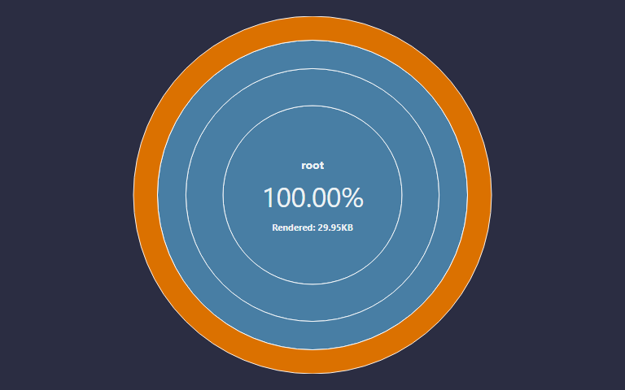
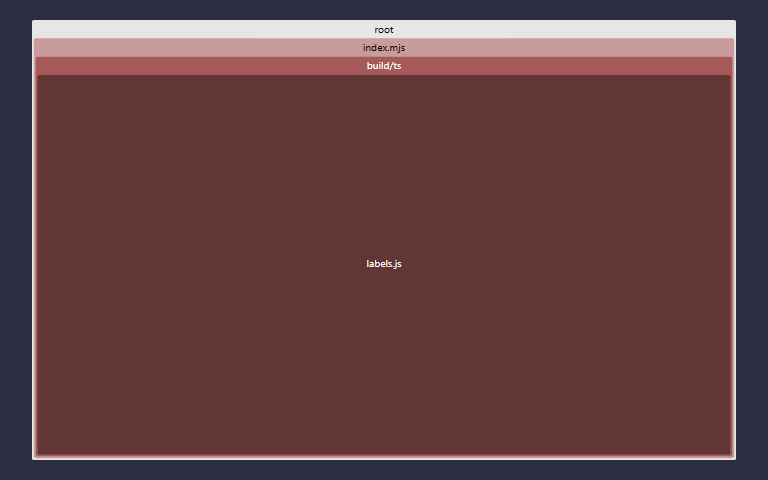
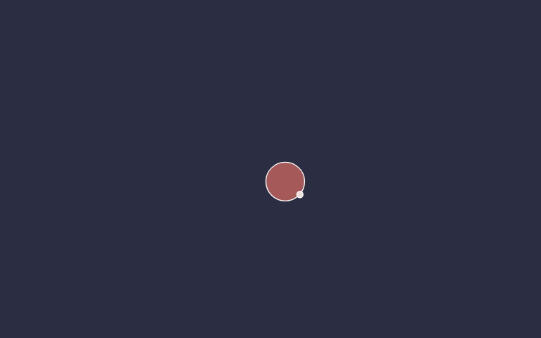
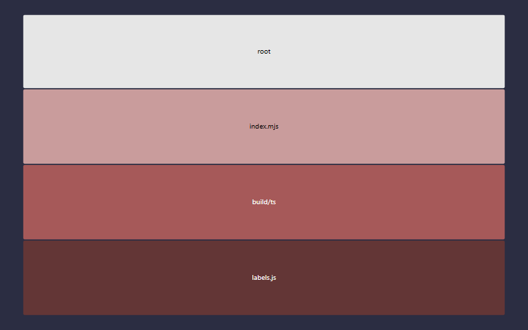

# issue_labels v0.3.0

> Version 0.3.0 was built on Friday, October 2, 2026 at GMT-07:00 `1790983743358` from hash `2d8e576`.

A general-purpose **286-label issue taxonomy** for GitHub projects — 20 categories, 55 subcategories — paired with a 3D force-directed colorer that places each label as a point in the sRGB cube so visually-similar labels indicate semantically-related concerns.

<!-- Supported embeds: 1790983743358 Friday, October 2, 2026 at GMT-07:00 100 5 20 2d8e576 {{stochbranch}} 100 {{stochfunc}} {{stochline}} 5 39 {{unitbranch}} {{unitfunc}} {{unitline}} 34 0.3.0 -->


&nbsp;

&nbsp;

## What's in here

* `src/data/standard_issue_label.json` — the taxonomy itself, one label per line, in the canonical serialized form. This is the artifact most consumers want.
* `src/build_js/assign_label_colors.cjs` — headless Node baker. Runs a force simulation in the sRGB cube and writes each label's settled position back as its `color` field. Also emits `docs/colors_trajectory.json` (the animation samples).
* `src/build_js/visualize_colors_3d.cjs` — generator for `docs/colors_3d.html`, the in-browser three.js sim. Multi-tier springs (label → subcategory centroid → category centroid), constellation links, live sliders, spin rig, hover info, "export colors" button.
* `src/build_js/bake_colors.cjs` — takes a `{ name: "#hex", ... }` map (the in-browser export) and writes the new colors back into the taxonomy JSON, preserving the canonical serialization.

The 20 categories: Type · Infrastructure · Component · Status · Estimation · Meta · Needs · Quality · Language · Outreach · Documentation · Significance · Testing · Platform · AI · Stakeholder · Pipeline · Business · Localization · Legal.

&nbsp;

## Usage

```bash
npm install
npm run viz        # bake colors (overwrites stored colors), then regenerate the HTML
npm run viz:html   # regenerate ONLY the HTML; preserves whatever's currently stored as `color`
npm run bake exported.json  # apply an in-browser export back to the taxonomy
```

The seed → live → export → bake loop:

1. `npm run viz` bakes a starting set of colors using the headless Node simulation.
2. Open `docs/colors_3d.html` in a browser. The in-browser sim runs more sophisticated physics (multi-tier springs, sub-sub floor, constellation links). The page's `seed()` randomizes positions per page-load (respecting per-channel pins), so the browser starts from a random state, not the stored `color`s.
3. Drag sliders, let it settle, click **export colors** — the result is on the clipboard as `{ name: "#hex" }`.
4. Save that to a file and run `npm run bake path/to/exported.json` to write it back into the JSON.
5. From here, **refresh the HTML with `npm run viz:html`** — NOT `npm run viz`. The latter re-runs the baker and overwrites the colors you just baked in.

&nbsp;

## Adding repo-specific labels

The taxonomy is meant to be cloned into a repo and then extended with a few labels that only make sense there. Repo-specific labels should read as part of the same lineup while staying visibly distinct from the standard set, so they get a reserved region of the color cube.

**The rule:** every standard label keeps at least one channel outside the middle third. The interior box, where **all three channels are in `(1/3, 2/3)`**, is reserved for repo-specific labels. In 8-bit terms, pick a hex where every channel is between `0x56` (86) and `0xA9` (169).

* Standard labels can never collide with an in-box color, so a repo-specific label is recognizable by its muted mid-tone alone.
* The box has plenty of room. For example, a set of area labels might use `a05c5c`, `5c74a0`, `5ca066`, `8e5ca0`, `a05c8a`, `a0965c`, `5ca0a0`, and `7aa05c`, with greys such as `5a5a5a`, `7a8a7a`, `8a7a8a`, and `a8a8a8` for type-style labels.
* A handful of standard labels sit inside the box deliberately and are whitelisted: the two `#808080` "unknown" neutrals, the Quality ladder greys, and the Mac brand grey. They are marked `exempt` or carry a `brand_color` in the taxonomy JSON. Treat them as exceptions, not precedent.
* The layout is a physics simulation, so the colors settle near the rule rather than proving it. The rule is the contract; check new colors against the rule, not against the neighbors.

A quick check for one color:

```bash
node -e 'const h=process.argv[1];const ok=[0,2,4].every(i=>{const v=parseInt(h.slice(i,i+2),16);return v>=86&&v<=169});console.log(ok?"in the reserved box":"outside the box - reserved for the standard set")' 5c74a0
```

Applying the taxonomy to a repo, and creating a repo-specific label in the box:

```bash
gh label clone StoneCypher/issue_labels --repo OWNER/REPO --force
gh label create "area:network" --repo OWNER/REPO --description "Networking, servers, accounts" --color 5c74a0 --force
```

`--force` also normalizes labels GitHub or Dependabot created on their own (for example `dependencies` becomes `Dependencies`), since label names are case-insensitive. When listing labels to check the result, pass `--limit 300`; `gh label list` stops at 30 by default and the taxonomy alone is 286.


&nbsp;

&nbsp;

## Test status

<table>
  <tr>
    <th></th>
    <th>Count</th>
    <th>Statement</th>
    <th>Branch</th>
    <th>Func</th>
    <th>Line</th>
  </tr>
  <tr>
    <th>Unit</th>
    <td>34</td>
    <td>100<small>%</small></td>
    <td>{{unitbranch}}<small>%</small></td>
    <td>{{unitfunc}}<small>%</small></td>
    <td>{{unitline}}<small>%</small></td>
  </tr>
  <tr>
    <th>Stochastic</th>
    <td>5</td>
    <td>100<small>%</small></td>
    <td>{{stochbranch}}<small>%</small></td>
    <td>{{stochfunc}}<small>%</small></td>
    <td>{{stochline}}<small>%</small></td>
  </tr>
</table>

<table>
  <tr>
    <th></th>
    <th>Docblock count</th>
    <th>20<small>%</small></th>
  </tr>
  <tr>
    <th>Docblock coverage</th>
    <td>5</td>
    <td>20<small>%</small></td>
  </tr>
</table>

* [Site](https://stonecypher.github.io/issue_labels/index.html)
* [Documentation](https://stonecypher.github.io/issue_labels/docs/index.html)
* [Builds](https://www.github.com/stonecypher/issue_labels/actions)
* [Source](https://www.github.com/stonecypher/issue_labels/)


<table>
  <tr>
    <td></td>
    <td></td>
  </tr>
  <tr>
    <td></td>
    <td></td>
  </tr>
</table>
